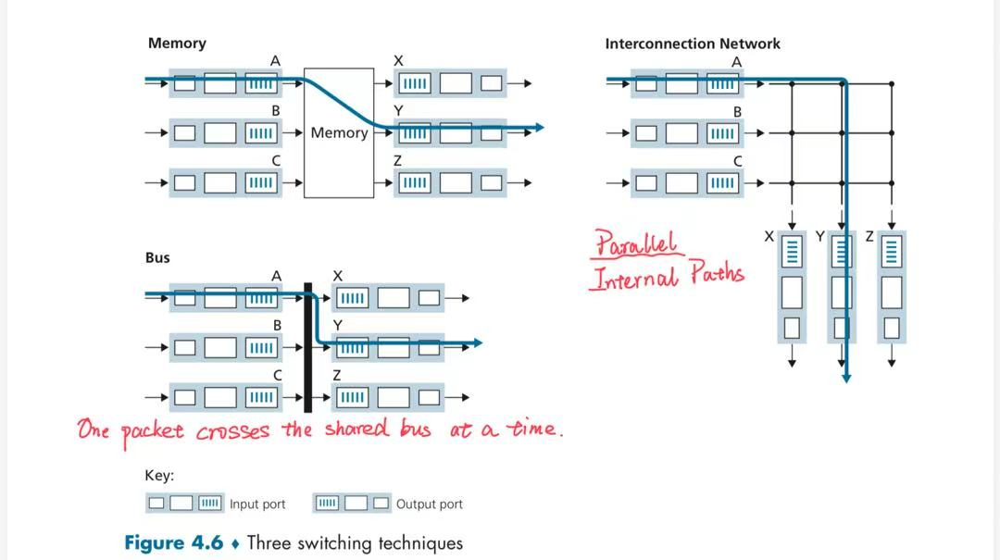
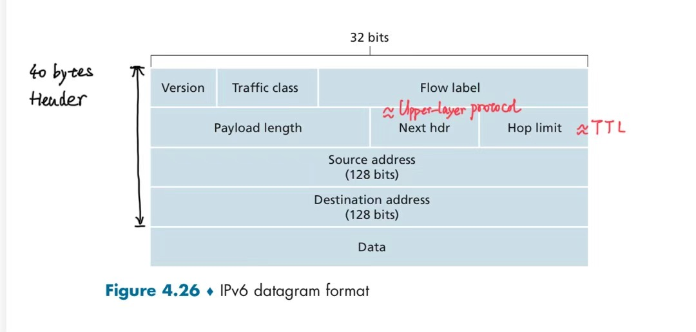
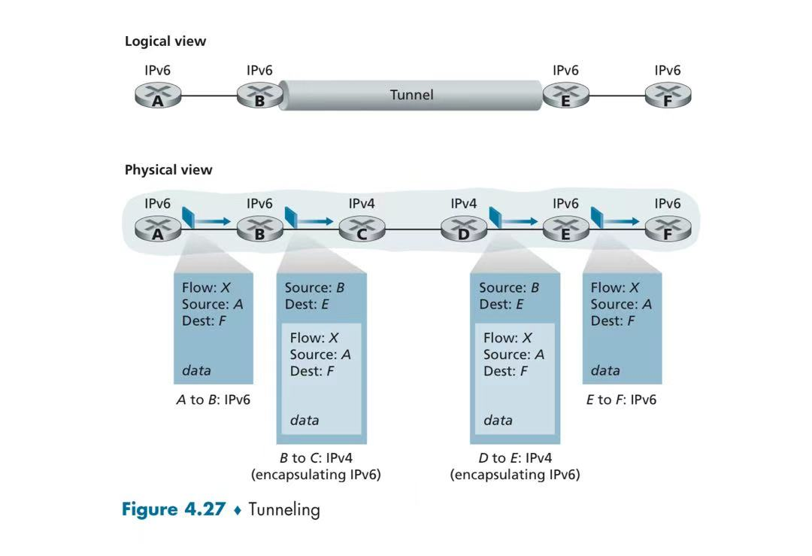
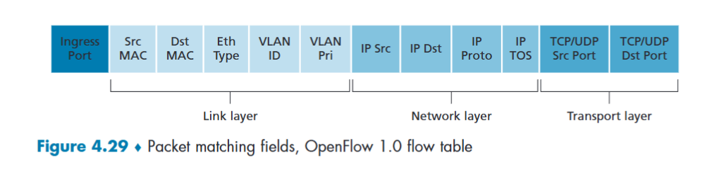

# Chapter 4 Network Layer: Data Plane

## Contents

- [4.1 Overview of Network Layer](#41-overview-of-network-layer)
- [4.2 Router](#42-router)
  - [Router Architecture](#router-architecture)
  - [Input Port](#input-port)
  - [Switching Fabric](#switching-fabric)
- [4.3 The Internet Protocol (IP)](#43-the-internet-protocol-ip)
  - [IPv4 Datagram Format](#ipv4-datagram-format)
  - [IPv4 Addressing](#ipv4-addressing)
  - [CIDR: Classless Inter-Domain Routing](#cidr-classless-inter-domain-routing)
  - [DHCP: Dynamic Host Configuration Protocol](#dhcp-dynamic-host-configuration-protocol)
  - [NAT: Network Address Translation](#nat-network-address-translation)
  - [IPv6 Datagram Format](#ipv6-datagram-format)
  - [Transitioning from IPv4 to IPv6](#transitioning-from-ipv4-to-ipv6)
- [4.4 Forwarding](#44-forwarding)
  - [Generalized Forwarding (Match + Actions)](#generalized-forwarding-match--actions)
  - [Matches](#matches)
  - [Actions](#actions)
  - [OpenFlow Abstractions](#openflow-abstractions)
- [4.5 Middleboxes](#45-middleboxes)

## 4.1 Overview of Network Layer

Transport segments between **hosts**:

- **sender**: encapsulates segments into datagrams, passes to link layer.
- **receiver**: delivers segments to transport layer protocol.

Network-layer protocols run in every Internet device: **hosts** and **routers**.

Network-layer functions:

- **Data Plane**: **local**, per-router function.
  - **forwarding**: **router-local action** of transferring a packet from router's input link to appropriate output link.
- **Control Plane**: **network-wide** logic.
  - **routing**: **network-wide process** that determines the end-to-end paths that packets take from source to destination. Two control-plane approaches:
    - **traditional routing algorithms**: implemented in routers.
    - **software-defined networking (SDN)**: implemented in (remote) servers.

Network-layer service model: **best-effort**.

No guarantees on:

- Successful datagram delivery.
- Timing or order of delivery.
- Bandwidth available to an end-to-end flow.

---

## 4.2 Router

### Router Architecture

| Component | Main functions | Plane |
| --- | --- | --- |
| Input port | Process link-layer frames; look up the output interface; queue packets | Data |
| Switching fabric | Transfer packets from input ports to output ports | Data |
| Output port | Schedule packets; encapsulate packets; transmit frames | Data |
| Routing processor | Run routing algorithms; maintain the routing table | Control |

### Input Port

1. **Physical-layer processing**: recover bits from incoming signals.
2. **Link-layer processing**: process the frame and extract the IP datagram.
3. **Lookup**: match the destination IP address against the forwarding table using **longest prefix matching**.
4. **Queuing**: a queued packet must wait for transfer through the fabric (even though its output port is free) because of **head-of-line (HOL) blocking** (another packet blocks the front of its input queue).
5. **Forwarding**: transfer the packet through the fabric to the appropriate output port.

### Switching Fabric



---

## 4.3 The Internet Protocol (IP)

### IPv4 Datagram Format


**Interface**: connection between a **host/router** and a **physical link**.

- A router may have **multiple** interfaces, each connected to a different link.
- A host typically has one or two interfaces (**wired Ethernet**, **wireless Wi-Fi**).

IP addresses are associated with each interface.

### IPv4 Addressing

IP address: **subnet portion** + **host portion**.

**Subnet** (IP network): interfaces can physically reach each other **without an intervening router**.

### CIDR: Classless Inter-Domain Routing

**Address notation**:

```math
\underbrace{a.b.c.d}_{\text{IPv4 address}} / \underbrace{x}_{\text{prefix length}}
```

- $a, b, c, d$: the four octets of the IPv4 address, each ranging from $0$ to $255$.
- $x$: number of bits in the **subnet portion**, where $0 \le x \le 32$.
- $32 - x$: number of bits in the **host portion**.

**Address structure** (32 bits in total):

```math
\underbrace{\boxed{\text{Subnet portion}}}_{x\text{ bits}}
\quad\Big|\quad
\underbrace{\boxed{\text{Host portion}}}_{(32-x)\text{ bits}}
```

**Subnet mask**:

```math
\text{Subnet mask} =
\underbrace{11\cdots1}_{x\text{ ones}}
\,\underbrace{00\cdots0}_{(32-x)\text{ zeros}}
```

### DHCP: Dynamic Host Configuration Protocol


### NAT: Network Address Translation

**Private IP address + original port** → **NAT device** → **Public IP address + mapped port**


### IPv6 Datagram Format



**IPv6 address representation**: 8 groups of 16 bits each ($8 \times 16 = 128$ bits in total). Each group has 4 hexadecimal digits in the full notation.

### Transitioning from IPv4 to IPv6



---

## 4.4 Forwarding

### Generalized Forwarding (Match + Actions)

Flow table in OpenFlow:

1. Priority number
2. **Match** conditions (fields in packet headers)
3. **Actions** to be taken
4. Counters

### Matches



### Actions

- Forwarding (destination-based forwarding)
- Dropping
- Modifying fields
- Encapsulating and forwarding to a controller

### OpenFlow Abstractions

| Device / function | Match | Actions |
| --- | --- | --- |
| Router | Longest destination IP prefix | Forward out a link |
| Switch (Layer 2 switching) | Destination MAC address | Forward or flood |
| Firewall | Source/destination IP addresses, port numbers, and protocols | Permit or deny |
| NAT | Source IP address and port (LAN) | Translate IP address and port (WAN) |
| Load balancer | Source/destination IP addresses and port numbers | Forward to multiple paths/servers |

---

## 4.5 Middleboxes

> Any intermediary box performing functions apart from the normal, standard functions of an IP router on the data path between a source host and a destination host.

| Service type | Middlebox function | Effect on communications | Purpose |
| --- | --- | --- | --- |
| NAT | Network Address Translation (NAT) | Rewrites IP addresses and ports to maintain address mappings | Enable internal addresses to communicate with external networks |
| Security services | Firewall | Allows or blocks traffic based on rules | Control access |
| Security services | Intrusion Detection System (IDS) | Checks for suspicious patterns in traffic and issues alerts | Detect attacks |
| Performance enhancements | Web cache | Stores copies of content for faster responses | Reduce latency and redundant transmissions |
| Performance enhancements | Load balancer | Distributes traffic among multiple servers | Share the service load |

**Network Function Virtualization (NFV)**: convert middlebox functions into **software** running on commodity servers/computing platforms instead of dedicated hardware.
