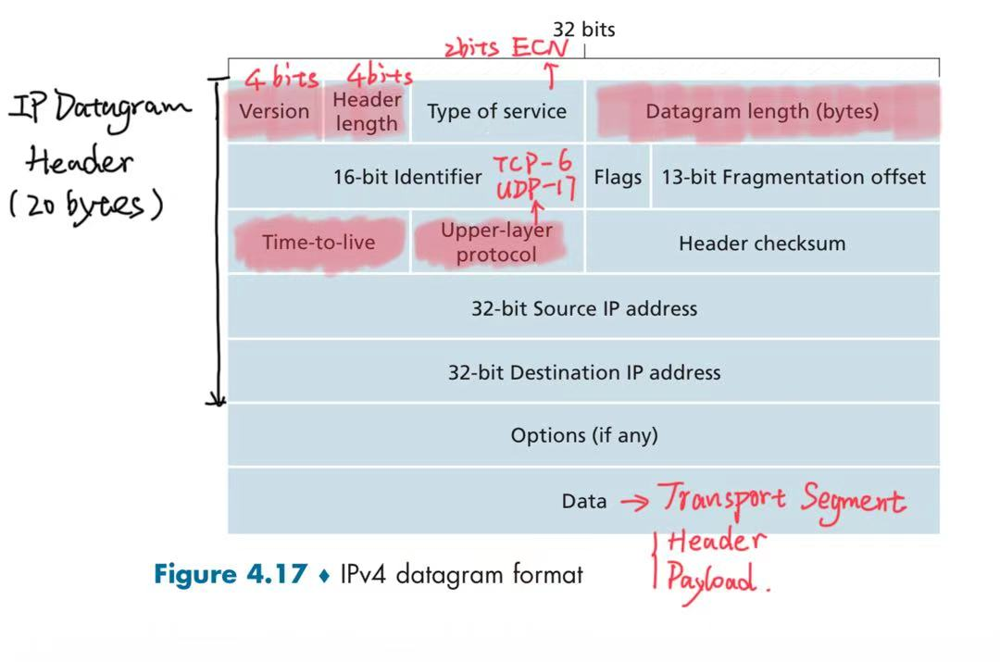
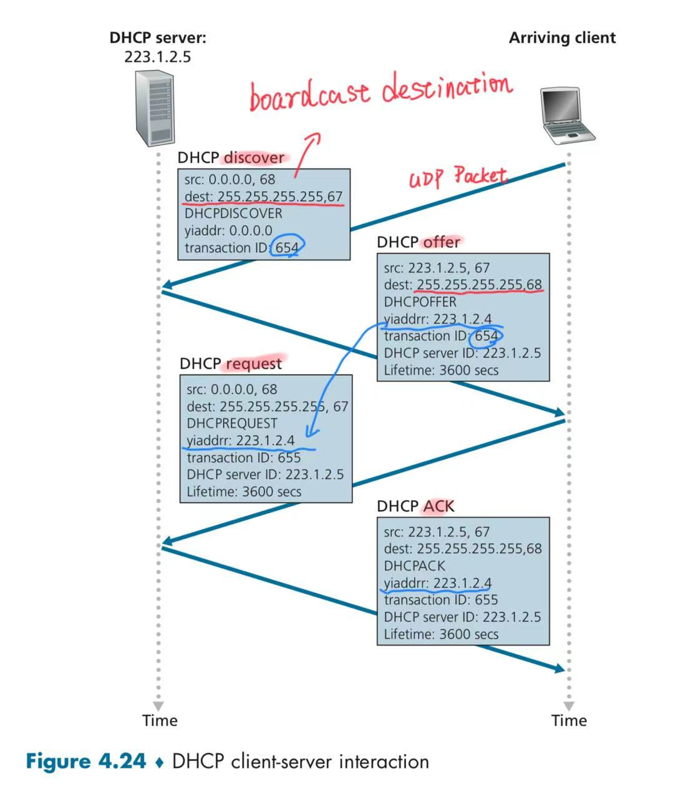
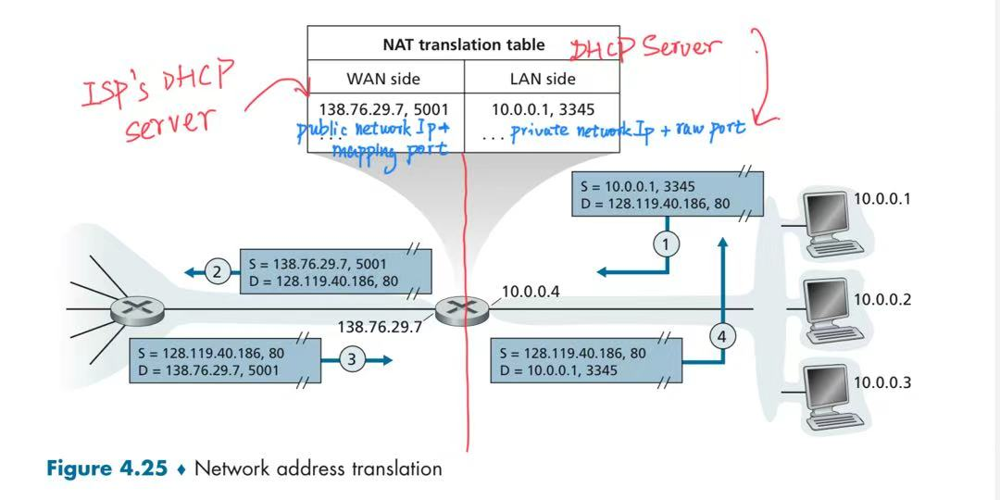

# Chapter 4 Network Layer: Data Plane

## Contents

- [Chapter 4 Network Layer: Data Plane](#chapter-4-network-layer-data-plane)
  - [Contents](#contents)
  - [4.1 Overview of Network Layer](#41-overview-of-network-layer)
  - [4.2 Router](#42-router)
  - [4.3 The Internet Protocol (IP)](#43-the-internet-protocol-ip)
    - [IP Datagram Format](#ip-datagram-format)
    - [IPv4 Addressing](#ipv4-addressing)
      - [CIDR: Classless Inter-Domain Routing](#cidr-classless-inter-domain-routing)
      - [DHCP: Dynamic Host Configuration Protocol](#dhcp-dynamic-host-configuration-protocol)
      - [NAT: Network Address Translation](#nat-network-address-translation)
  - [4.4 Forwarding](#44-forwarding)
  - [4.5 Middleboxes](#45-middleboxes)

## 4.1 Overview of Network Layer

Transport segments between **hosts**:

- **sender**: encapsulates segments into datagrams, passes to link layer.
- **receiver**: delivers segments to transport layer protocol.

Network-layer protocols run in every Internet device: **hosts** and **routers**.

Network-layer functions:

- **Data Plane**: **local**, per-router function.
  - **forwarding**: **router-local action** of transferring a packet from router's input link to appropriate output link.
- **Control Plane**: **network-wide** logic.
  - **routing**: **network-wide process** that determines the end-to-end paths that packets take from source to destination. Two control-plane approaches:
    - **traditional routing algorithms**: implemented in routers.
    - **software-defined networking (SDN)**: implemented in (remote) servers.

Network-layer service model: **best-effort**.

No guarantees on:

- Successful datagram delivery.
- Timing or order of delivery.
- Bandwidth available to an end-to-end flow.

---

## 4.2 Router

---

## 4.3 The Internet Protocol (IP)

### IP Datagram Format



**Interface**: connection between a **host/router** and a **physical link**.

- A router may have **multiple** interfaces, each connected to a different link.
- A host typically has one or two interfaces (**wired Ethernet**, **wireless Wi-Fi**).

IP addresses are associated with each interface.

### IPv4 Addressing

IP address: **subnet portion** + **host portion**.

**Subnet** (IP network): interfaces can physically reach each other **without an intervening router**.

#### CIDR: Classless Inter-Domain Routing

**Address notation**:

```math
\underbrace{a.b.c.d}_{\text{IPv4 address}} / \underbrace{x}_{\text{prefix length}}
```

- $a, b, c, d$: the four octets of the IPv4 address, each ranging from $0$ to $255$.
- $x$: number of bits in the **subnet portion**, where $0 \le x \le 32$.
- $32 - x$: number of bits in the **host portion**.

**Address structure** (32 bits in total):

```math
\underbrace{\boxed{\text{Subnet portion}}}_{x\text{ bits}}
\quad\Big|\quad
\underbrace{\boxed{\text{Host portion}}}_{(32-x)\text{ bits}}
```

**Subnet mask**:

```math
\text{Subnet mask} =
\underbrace{11\cdots1}_{x\text{ ones}}
\,\underbrace{00\cdots0}_{(32-x)\text{ zeros}}
```

#### DHCP: Dynamic Host Configuration Protocol



#### NAT: Network Address Translation

**Private IP address + original port** → **NAT device** → **Public IP address + mapped port**



---

## 4.4 Forwarding

---

## 4.5 Middleboxes
