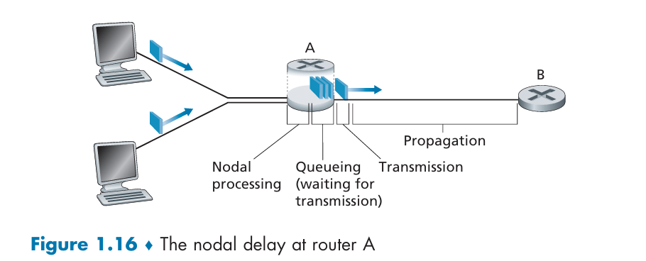
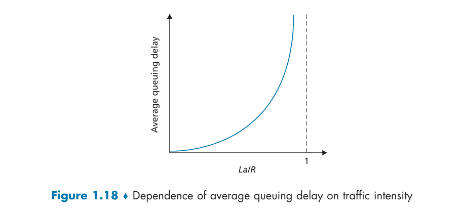
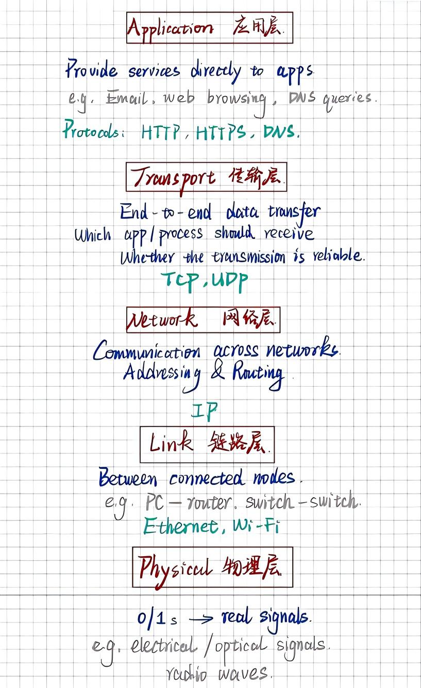

# Chapter 1 Introduction

## Roadmap
- 1.1 Overview
- 1.2 Network Edge
  - Access networks
    - Home: DSL, cable, Fiber to the Home (FTTH), 5G fixed wireless
    - Public area: Ethernet, Wi-Fi
    - Wide area: 4G, 5G
  - Physical media
- 1.3 Network Core
  - Packet switching vs. circuit switching
  - Network of networks
- 1.4 Delay, Loss, and Throughput
- 1.5 Protocol Layers

## 1.1 Overview
End systems, or hosts, are connected by:
- **communication links** using different kinds of physical media
- **packet switches**, such as link-layer switches and routers

They run network protocols to exchange messages, such as:
- **Transmission Control Protocol (TCP)**
- **Internet Protocol (IP)**

Protocols define the **format** and **order** of exchanged messages, as well as the **actions** taken during message transmission and receipt.

## 1.2 Network Edge

### Access Networks

#### Residential Access
1. Digital Subscriber Line (DSL)
   - Uses the telephone company's existing local telephone infrastructure.
   - Translates between digital data and analog signals using a **DSL modem** and a **DSL access multiplexer (DSLAM)**.
   - Voice and data are transmitted at different frequencies over a **dedicated** line to the central office.

2. Cable Internet Access
   - Uses the cable television company's existing cable TV infrastructure.
   - Translates between digital data and analog signals using a **cable modem** and a **cable modem termination system (CMTS)**.
   - TV and data are transmitted at different frequencies over a **shared** cable distribution network.

These access networks are often **asymmetric**, with high-speed downstream transmission and lower-speed upstream transmission.

3. Fiber to the Home (FTTH)
   - Provides an optical fiber path from the central office directly to each home.
   - Uses two optical distribution architectures: **Active Optical Network (AON)** and **Passive Optical Network (PON)**.
   - A typical PON path is:
     `router (Internet access) <-> ONT <-> splitter <-> OLT`

4. 5G Fixed Wireless
   - Uses the cellular network to provide broadband access to fixed locations such as homes.

#### Public-area Access
Local area networks (LANs):
- Wired LAN: **Ethernet**
- Wireless LAN: **Wi-Fi**

#### Wide-area Access
4G and 5G cellular access networks:
- End systems send and receive packets through **base stations** operated by the cellular network provider.

### Physical Media
Guided media: signals are guided along a solid medium.
- **Twisted-pair copper wire**: dial-up modem, DSL, Ethernet
- **Coaxial cable**: cable TV, cable Internet access
- **Fiber optics**: broadband, long-distance communication

Unguided media: signals propagate through the atmosphere or outer space.
- **Terrestrial radio**
  - Short distance: Bluetooth
  - Local area: wireless LAN
  - Wide area: cellular access
- **Satellite radio**: geostationary satellites and low-Earth-orbit (LEO) satellites

## 1.3 Network Core

### Packet Switching vs. Circuit Switching
- **Packet switching**
  - **Store-and-forward**: the entire packet must be received before it can be transmitted onto the outgoing link.
  - **Output buffer (queue)**: packets wait in the buffer until the link becomes available, which causes **queueing delay**.
  - **Packet loss**: packets may be dropped if the buffer is full.
  - **Statistical multiplexing**: multiple users share a link, which improves efficiency.
  - **Forwarding table**: maps a destination address to the router's outbound link.

- **Circuit switching**
  - A **dedicated circuit** is reserved for the entire duration of the communication session.
  - Resources are **not shared** and may be wasted during **silent periods**.
  - Multiplexing methods:
    - **Frequency-division multiplexing (FDM)**: each user is allocated a specific frequency band.
    - **Time-division multiplexing (TDM)**: each user is allocated a unique time slot in every frame.

### Network of Networks
- **ISP (Internet Service Provider):** provides wired or wireless access, such as DSL, cable, FTTH, Wi-Fi, and cellular access, to end systems.
- **PoP (point of presence):** a group of routers in a specific geographical area where customers can connect to the provider's network.
- **Multihoming:** an ISP connects to multiple provider ISPs for reliability and load balancing.
- **Peering:** nearby ISPs at the same level exchange traffic directly without paying a third-party ISP.
- **IXP (Internet Exchange Point):** a physical infrastructure where multiple ISPs can peer with one another.
- **Tier-1 ISP:** an ISP at the highest level, providing national or international coverage.
- **Content provider network:** large Internet companies own and operate private networks that connect their data centers to the Internet, bypassing some tier-1 and regional ISPs.

## 1.4 Delay, Loss, and Throughput

### Types of Delays
- **Processing delay:** the time required to examine the packet header, determine the destination, and check for bit-level errors.
- **Queueing delay:** the time spent waiting to be transmitted onto the outgoing link; it depends on the congestion level of the queue.
- **Transmission delay:** the time required to push all bits of the packet onto the link.

$$\text{Transmission delay} = \frac{L \; (\text{packet length in bits})}{R \; (\text{transmission rate / link bandwidth in bits/s})}$$

- **Propagation delay:** the time required for bits to travel across the physical link.

$$\text{Propagation delay} = \frac{d \; (\text{length of physical link})}{s \; (\text{propagation speed} \approx 2 \times 10^8 \text{ m/s})}$$

The total nodal delay is:

$$d_{nodal} = d_{proc} + d_{queue} + d_{trans} + d_{prop}$$

### Traffic Intensity
- `a` = average rate at which packets arrive at the queue (packets/s)
- `L` = packet length (bits)

$$\text{Traffic intensity} = \frac{La}{R}$$

- If `La/R ≈ 0`, the average queueing delay is small.
- If `La/R ≈ 1`, the average queueing delay becomes larger and larger.
- If `La/R > 1`, the average arrival rate exceeds the transmission rate, so the queue will grow without bound and the average queueing delay will approach infinity.

If the queue is full, arriving packets will be dropped, resulting in **packet loss**.

### Throughput
Throughput is the rate at which bits are transferred between the sender and receiver.
- **Instantaneous throughput:** the rate at a given point in time
- **Average throughput:** the rate over a longer period of time

End-to-end throughput is limited by the **bottleneck link**:

$$\min\{R_1, R_2, \ldots, R_n\}$$

## 1.5 Protocol Layers (Five-layer Internet Protocol Stack)
- **Application:** provides services to end-user applications
  - Examples: email, web browsing, DNS
  - Protocols: **HTTP/HTTPS**, **DNS**

- **Transport:** provides end-to-end data transfer, including process-to-process delivery and reliability
  - Protocols: **TCP**, **UDP**

- **Network:** handles communication across networks, including addressing and routing
  - Core protocol: **IP**

- **Link:** handles data transfer between directly connected nodes
  - Examples: PC-to-router, switch-to-switch
  - Protocols: **PPP**, **Ethernet**, **Wi-Fi**

- **Physical:** converts 0s and 1s into actual signals
  - Examples: fiber optics, copper wire, radio

