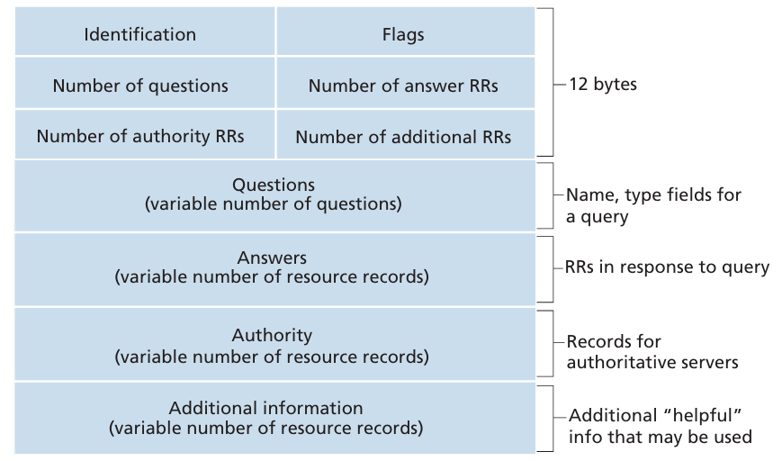

# Chapter 2 Application Layer

<a id="contents"></a>
## Contents

- [Chapter 2 Application Layer](#chapter-2-application-layer)
  - [Contents](#contents)
  - [2.1 Principles of Network Applications](#21-principles-of-network-applications)
    - [Application Architectures](#application-architectures)
    - [Process Communication](#process-communication)
      - [1. Within the Same Host](#1-within-the-same-host)
      - [2. Across Different Hosts](#2-across-different-hosts)
    - [Transport-Layer Services for the Application Layer](#transport-layer-services-for-the-application-layer)
  - [2.2 The Web and HTTP (Hypertext Transfer Protocol)](#22-the-web-and-http-hypertext-transfer-protocol)
    - [HTTP Message Format](#http-message-format)
    - [Cookies](#cookies)
    - [Web Caches](#web-caches)
  - [2.3 Electronic Mail](#23-electronic-mail)
  - [2.4 DNS (Domain Name System)](#24-dns-domain-name-system)
    - [Hierarchy of DNS Servers](#hierarchy-of-dns-servers)
    - [DNS Resource Records](#dns-resource-records)
    - [DNS Protocol \& Message](#dns-protocol--message)
  - [2.5 Peer-to-Peer File Distribution](#25-peer-to-peer-file-distribution)
    - [Scalability Analysis: Client-Server vs P2P](#scalability-analysis-client-server-vs-p2p)
    - [BitTorrent](#bittorrent)
  - [2.6 Video Streaming and CDN (Content Distribution Network)](#26-video-streaming-and-cdn-content-distribution-network)
    - [DASH (Dynamic Adaptive Streaming over HTTP)](#dash-dynamic-adaptive-streaming-over-http)
    - [CDN (Content Distribution Network)](#cdn-content-distribution-network)

--- 

## 2.1 Principles of Network Applications

### Application Architectures

 1. **Client-Server** 
     - **Centralized** always-on server with a permanent IP address
     - data centers for scaling
 2. **Peer-to-Peer** 
     - **Decentralized**
     - Self-scalable
     - Peers are intermittently connected and change IP addresses

### Process Communication
#### 1. Within the Same Host
Inter-process communication (defined by the OS)
To check the processes running on the host: Task Manager (Windows) -> Details:
  
Or open command line and type:
```bash
netstat -ano
```


#### 2. Across Different Hosts
By exchanging **messages** to/from a **socket**, which is the API between the **application layer** and the **transport layer**. A socket is identified by an **IP address** (which identifies the host) and a **port number** (which identifies the receiving process on the host). 


The client process initiates communication.  

The server process waits for incoming connections.

### Transport-Layer Services for the Application Layer
The transport layer *could* provide, in general:
 1. **Data transfer reliability** (TCP/UDP)
 2. **Throughput**
 3. **Timing**
 4. **Security** (e.g., encryption, authentication)

The Internet (TCP/IP networks) actually provides only 1 and 4, not 2 and 3.

[Back to Contents](#contents)

--- 

## 2.2 The Web and HTTP (Hypertext Transfer Protocol)

A web page consists of **objects** (e.g., an HTML file, a JPEG image, a video clip, etc.). Each object is addressed by a **URL** (Uniform Resource Locator) and identified by a **hostname + path name**.   

HTTP uses **TCP**. The client initiates a TCP connection with the server, then sends requests and receives responses through a **socket**.


### HTTP Message Format
HTTP Request Format:


HTTP Response Format:


### Cookies
An identifier set by the server and stored by the browser, which is sent back to the server with every HTTP request. The server can use it to retrieve the state and data of the user (e.g., login status, personalization, etc.).

### Web Caches
client <---> **Web Cache (Proxy Server)** <---> origin
1. Reduce response time for client 
2. Reduce traffic on access link to origin server

```python
# How the web cache works with Conditional GET:
Receive an HTTP request for object 'x' from the client;
if the cache misses (object 'x' is not in the cache):
    cache -> origin server:     GET x;
    origin server -> cache:     200 OK + object 'x' + Last-Modified;
    cache stores object 'x' and its Last-Modified time;
    cache -> client:            200 OK + object 'x';
else: # cache hit
    cache -> origin server: GET object 'x' with `If-Modified-Since` (= Last-Modified time);

    if object 'x' is not modified since the Last-Modified time:
        origin server -> cache: 304 Not Modified;
        cache -> client:        200 OK + object 'x';
    else: # object 'x' is modified since the Last-Modified time
        origin server -> cache: 200 OK + object 'x' + Last-Modified;
        cache updates object 'x' and its Last-Modified time;
        cache -> client:        200 OK + object 'x';
```

[Back to Contents](#contents)

---

## 2.3 Electronic Mail
Three major components:
1. **User Agent**
2. **Mail Server**
3. **SMTP** (Simple Mail Transfer Protocol)  


Email communication:


HTTP and IMAP (Internet Message Access Protocol) are used for **retrieving** emails from the mail server to the user agent.

*Push Protocol*: The side **possesses the data**, **actively sends data** to the other side. The sender is responsible for **delivery**. (e.g., SMTP)

*Pull Protocol*: The side **wants the data** and **sends a request to retrieve it**. The receiver is responsible for **retrieval**. (e.g., HTTP, IMAP)

[Back to Contents](#contents)

---

## 2.4 DNS (Domain Name System)

The DNS is a:
1. **distributed database** implemented in a **hierarchy of DNS servers**
2. **application-layer protocol** that allows hosts to query the distributed database

The DNS is used to map **hostname** to **IP address** (Alias hostname -> canonical hostname -> IP address). 
e.g., `www.somecompany.com` -> `server12.london.somecompany.com` -> `121.7.106.42`.

### Hierarchy of DNS Servers
1. **Root DNS Servers**
2. **Top-level domain (TLD) Servers** (e.g., `.com`, `.org`, `.edu`. `uk`, etc.)
3. **Authoritative DNS Servers**, which host organizations' publicly accessible DNS records
4. **Local DNS Servers**
   - Provided by ISPs, act as a *proxy*, and forward queries into the hierarchy.
   - Cache recent name-to-address translation pairs locally to reduce query time and traffic in the hierarchy. Cache entries time out after the TTL (Time To Live).

End hosts -> Local DNS: **recursive query** (the local DNS is responsible for querying the DNS hierarchy and directly returning the result) 
Local DNS -> Other DNS: **iterative query** (the local DNS is told which DNS server to contact next until it reaches the authoritative DNS server and gets the result)

### DNS Resource Records
Resource Record (RR) format:
```python
RR = (Name, Value, Type, TTL);

Type = A:
    Name = hostname
    Value = IP address
    # (server12.london.somecompany.com, 121.7.106.42, A, 3600)
Type = NS: 
    Name = domain
    Value = hostname of authoritative name server for this domain
    # Used to route DNS queries further along in the DNS hierarchy
    # (somecompany.com, dns-server1.somecompany.com, NS, 3600)
Type = CNAME:
    Name = Alias hostname
    Value = Canonical hostname
    # (www.somecompany.com, server12.london.somecompany.com, CNAME, 3600)

Type = MX: 
    Name = Alias hostname of mail server
    Value = Canonical hostname of mail server
    # (somecompany.com, mail.somecompany.com, MX, 3600)


################# Example #################
(NS)somecompany.com -> dns-server1.somecompany.com
(A) dns-server1.somecompany.com -> 120.2.105.38

(CNAME)www.somecompany.com -> server12.london.somecompany.com
(A)server12.london.somecompany.com -> 121.7.106.42

(MX)somecompany.com -> mail.somecompany.com
(A)mail.somecompany.com -> 192.0.2.50
```

### DNS Protocol & Message
Both DNS *query* and *reply* messages have the same format:

- Identification: query and reply to query have the same ID
- Flags:
  - `Query`/`Reply`: 0 for query, 1 for reply
  - `Authoritative`: 1 if the responding DNS server is authoritative for the queried hostname
  - `Recursion Desired`: 1 if the client wants the DNS server to perform recursive query
  - `Recursion Available`: 1 if the DNS server can perform recursive query

[Back to Contents](#contents)

---

## 2.5 Peer-to-Peer File Distribution

### Scalability Analysis: Client-Server vs P2P
File size = F bits
Server upload rate = $u_s$ bits/s
There are N peers, each peer upload rate = $u_i$ bits/s, download rate = $d_i$ bits/s

What is the minimum distribution time $D$ to distribute the file to all N peers?

Client-Server: 

$$D_{C-S} \geq \max(\frac{NF}{u_s}, \frac{F}{d_{min}})$$  

where $d_{min} = \min\{d_1, d_2, \ldots, d_N\}$   
The distribution time grows linearly with N as more peers are added, which is not scalable.  

P2P:

$$D_{P2P} \geq \max(\frac{F}{u_s}, \frac{F}{d_{min}}, \frac{NF}{u_s + \sum_{i=1}^N u_i})$$     
Each peer brings additional upload capacity, so the distribution time does not grow linearly with N, which is more scalable.

### BitTorrent
Tracker: tracks peers participating in torrent
Torrent: group of peers exchanging chunks of a file

A file is divided into many chunks, and the peers exchange those chunks within a torrent. A new peer joins with no chunks, registers with the tracker, gets a list of peers, and establishes TCP connections with them. It requests missing chunks from neighbors and downloads them while uploading the chunks it already has to others. Once a peer has the entire file, it may selfishly leave or altruistically remain in the torrent.

Core mechanism:
1. **Rarest first**: each peer first requests the chunk that is least replicated among its neighbors, so rare chunks spread quickly and do not become a bottleneck.
2. **Tit-for-tat**: each peer prefers to upload to neighbors that are currently uploading to it at the highest rate. This encourages mutual sharing instead of free-riding.  

[Back to Contents](#contents)

---
  
## 2.6 Video Streaming and CDN (Content Distribution Network)
The dimensions of video:
1. Codec (Coder-Decoder): The algorithm used to compress raw video/audio for storage, and decompress it for playing.
    - H.264/AVC (Advanced Video Coding)
    - H.265/HEVC (High Efficiency Video Coding)
2. Resolution: Number of pixels in width x height. More pixels = more details
   - 720p (HD): 1280*720 
   - 1080p (Full HD): 1920*1080
   - 4K (Ultra HD): 3840*2160
3. Frame Rate/FPS: Number of frames displayed per second
     - 24fps: movies, classic 'film look'
     - 25fps: TV in UK, Europe, China (PAL standard)
     - 30fps: online video
     - 60fps: Sports broadcasts, gaming
     - 120fps: slow-motion source footage
4. Bitrate: Amount of data transmitted per second, measured in Mbps (Megabits per second) or kbps. Higher bitrate = better quality, larger file size
      - CBR (Constant Bitrate): same bitrate throughout
      - VBR (Variable Bitrate): varying bitrate based on content complexity
5. Bit Depth: Number of bits used to represent each color channel of pixel
     - 8-bit: 256  (2^8) levels per channel, 16.7 million colors
     - 10-bit: 1024 (2^10) levels per channel, 1.07 billion colors
     - 12-bit: 4096 (2^12) levels per channel, 68.7 billion colors
### DASH (Dynamic Adaptive Streaming over HTTP)
Server:
- Divides video file into multiple chunks
- Each chunk is stored and encoded at different bitrate and quality levels (e.g., 720p, 1080p, 4K)
- **Manifest**: provides URLs for the different chunks at different quality levels 
  
Client: 
- Periodically measures server-to-client bandwidth and buffer status
- Consults the manifest and requests an appropriate chunk quality level based on current network conditions (higher quality when more bandwidth is available)

### CDN (Content Distribution Network)
Two CDN deployment philosophies:
1. **Enter Deep**: Deploy CDN servers **deep into** many access networks (close to users). e.g., Akamai — thousands of locations. Low delay, high throughput to users, but harder to manage.
2. **Bring Home**: Fewer, **larger clusters** at key locations (e.g., Internet Exchange Points), "bring" users to them. e.g., Limelight. Easier to manage, slightly higher delay.

[Back to Contents](#contents)
