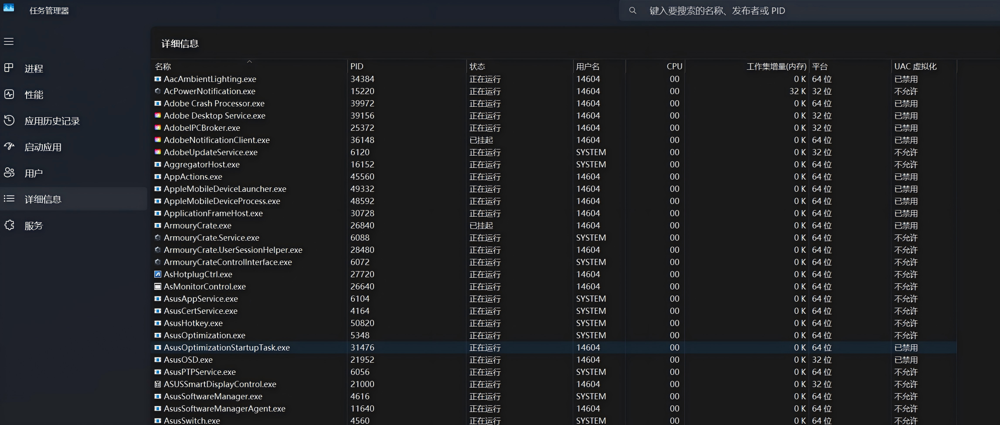
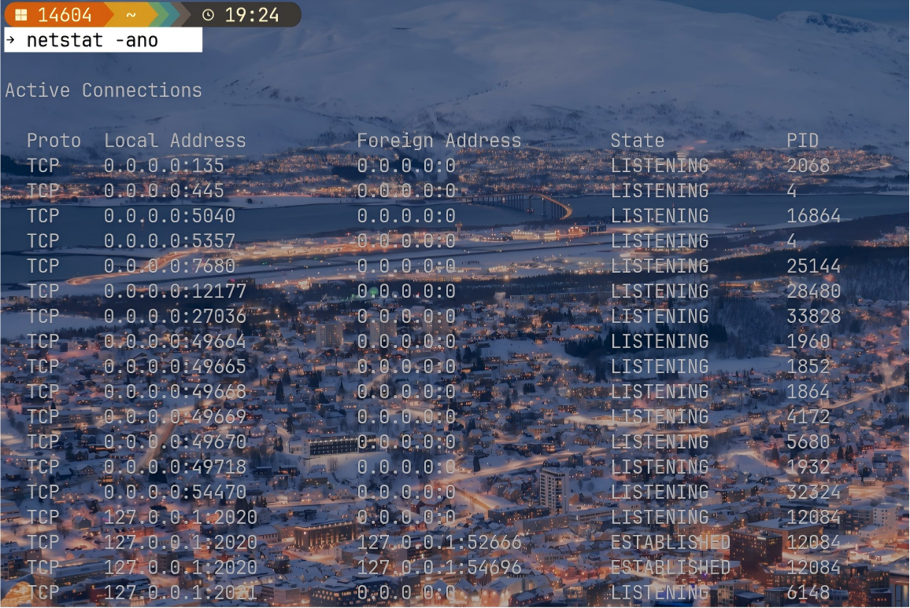
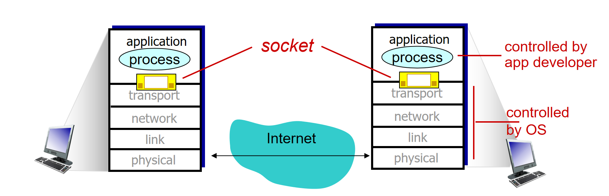
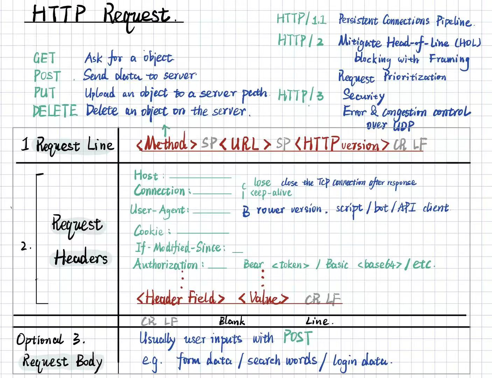
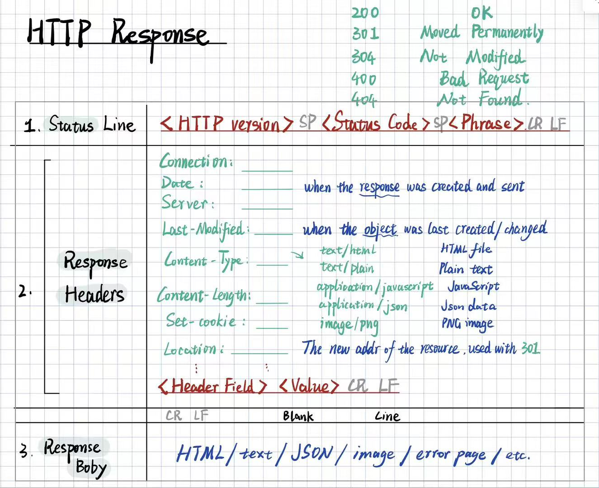
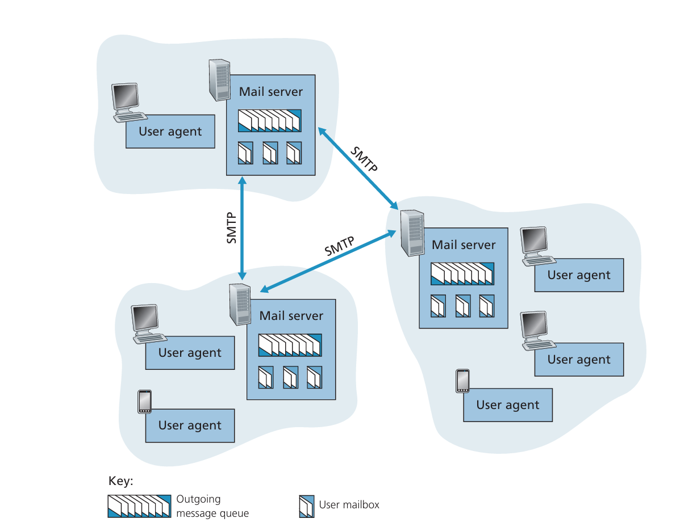
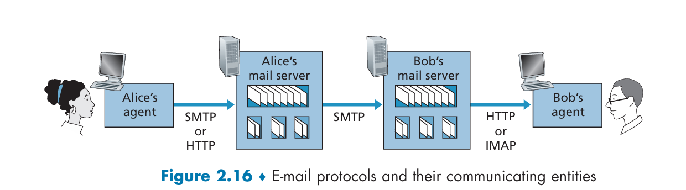

# Chapter 2 Application Layer


--- 

## 2.1 Principles of Network Applications

### Application Architectures

 1. **Client-Server** 
     - **Centralized** always-on server with Permanent IP address
     - data centers for scaling
 2. **Peer-to-Peer** 
     - **Decentralized**
     - Self-scalable
     - Peers are intermittently connected and change IP addresses

### Process communicating

##### 1. Within the same host: 
Inter-process Communication (defined by OS) 
To check the processes running on the host: TaskManager (Windows) - > Details:
  
Or open command line and type:
```bash
netstat -ano
```



##### 2. Across different hosts: 
by exchanging **message** to/from **socket**, which is the API between **Application-layer** and **Transport-layer**, identified by **IP address** (identify the host)+ **port number** (identify the receiving process on the host)  


Client process initiates communication  

Server process waits to be connected

### Transport-layer Services to Application Layer:
Transport-layer *could* provide in general:
 1. **Data transfer reliability** (TCP/UDP)
 2. **Throughput**
 3. **Timing**
 4. **Security** (e.g., encryption, authentication)

The Internet (TCP/IP networks) actually provides only 1&4, but not 2&3.

--- 

## 2.2 The Web and HTTP(Hypertext Transfer Protocol)

A Web page is consists of **objects**(e.g. HTML file, JPEG image, video clip, etc.). Each object is addressed by a **URL**(Uniform Resource Locator) and identified by **hostname + path name**.   

HTTP uses **TCP**. Client initiates TCP connection with server, then send request/receive response through **socket**.


### HTTP Message Format
HTTP Request Format:



HTTP Response Format:



### Cookies
An identifier set by the server and stored by the browser, which is sent back to the server with every HTTP request. The server can use it to retrieve the state and data of the user (e.g., login status, personalization, etc.).

### Web Caches
client <---> **Web Cache (Proxy Server)** <---> origin
1. Reduce response time for client 
2. Reduce traffic on access link to origin server

```python
# How the web cache works with Conditional GET:
Receive HTTP request for an object'x' from client;
if cache misses (object'x' is not in cache):
    cache -> origin server:     GET x;
    origin server -> cache:     200 OK + object'x' + Last-Modified;
    cache stores object'x' and its Last-Modified Time;
    cache -> client:            200 OK + object'x';
else: # cache hit
    cache -> origin server: GET object'x' with `If-Modified-Since` field (= Last-Modified Time);

    if object'x' is not modified since Last-Modified Time:
        origin server -> cache: 304 Not Modified;
        cache -> client:        200 OK + object'x';
    else: # object'x' is modified since Last-Modified Time
        origin server -> cache: 200 OK + object'x' + Last-Modified;
        cache updates object'x' and its Last-Modified Time;
        cache -> client:        200 OK + object'x';
```

---

## 2.3 Electronic Mail
Three major components:
1. **User Agent**
2. **Mail Server**
3. **SMTP** (Simple Mail Transfer Protocol)  


Email communication:



The HTTP and IMAP(Internet Message Access Protocol) are used for **retrieving** emails from the mail server to the user agent.

*Push Protocol*: The side **possesses the data**, **actively sends data** to the other side. The sender is responsible for **delivery**. (e.g., SMTP)

*Pull Protocol*: The side **wants the data**, **sends request to retrieve it**. The receiver is responsible for **retrieval**. (e.g., HTTP, IMAP)

---

## 2.4 DNS (Domain Name System)

The DNS is a:
1. **distributed database** implemented in a **hierarchy of DNS servers**
2. **application-layer protocol** that allows hosts to query the distributed database

The DNS is used to map **hostname** to **IP address** (Alias hostname -> canonical hostname -> IP address). 
e.g., `www.somecompany.com` -> `server12.london.somecompany.com` -> `121.7.106.42`.

### Hierarchy of DNS Servers
1. **Root DNS Servers**
2. **Top-level domain (TLD) Servers** (e.g., `.com`, `.org`, `.edu`. `uk`, etc.)
3. **Authoritative DNS Servers**, house organizations' publicly accessible DNS records
4. **Local DNS Servers**
   - Provided by ISPs, act as *proxy*, forward query into hierarchy.
   - Cache recent name-to-address translation pairs locally to reduce query time and traffic in hierarchy. Cache entries timeout after TTL (Time To Live).

End hosts -> Local DNS: **recursive query** (Local DNS is responsible for query DNS hierarchy and directly return the result) 
Local DNS -> Other DNS: **Iterative query** (Local DNS is told which DNS server to contact next, until it reaches the authoritative DNS server and gets the result)

### DNS Resource Records
Resource Record (RR) format:
```python
RR = (Name, Value, Type, TTL);

Type = A:
    Name = hostname
    Value = IP address
    # (server12.london.somecompany.com, 121.7.106.42, A, 3600)
Type = NS: 
    Name = domain
    Value = hostname of authoritative name server for this domain
    # Used to route DNS queries further along in the DNS hierarchy
    # (somecompany.com, dns-server1.somecompany.com, NS, 3600)
Type = CNAME:
    Name = Alias hostname
    Value = Canonical hostname
    # (www.somecompany.com, server12.london.somecompany.com, CNAME, 3600)

Type = MX: 
    Name = Alias hostname of mail server
    Value = Canonical hostname of mail server
    # (somecompany.com, mail.somecompany.com, MX, 3600)


################# Example #################
(NS)somecompany.com -> dns-server1.somecompany.com
(A) dns-server1.somecompany.com -> 120.2.105.38

(CNAME)www.somecompany.com -> server12.london.somecompany.com
(A)server12.london.somecompany.com -> 121.7.106.42

(MX)somecompany.com -> mail.somecompany.com
(A)mail.somecompany.com -> 192.0.2.50
```

### DNS Protocol & Message