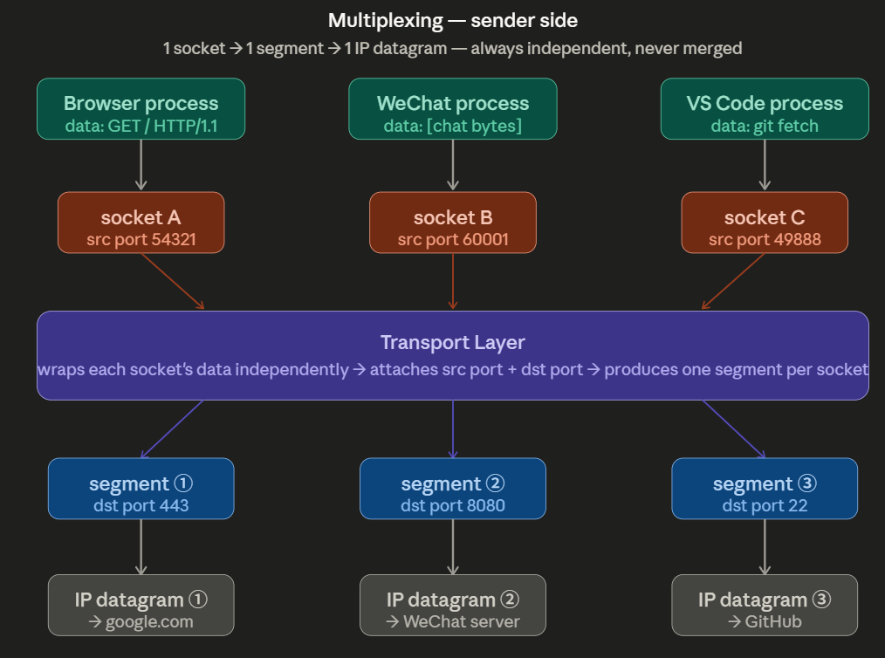
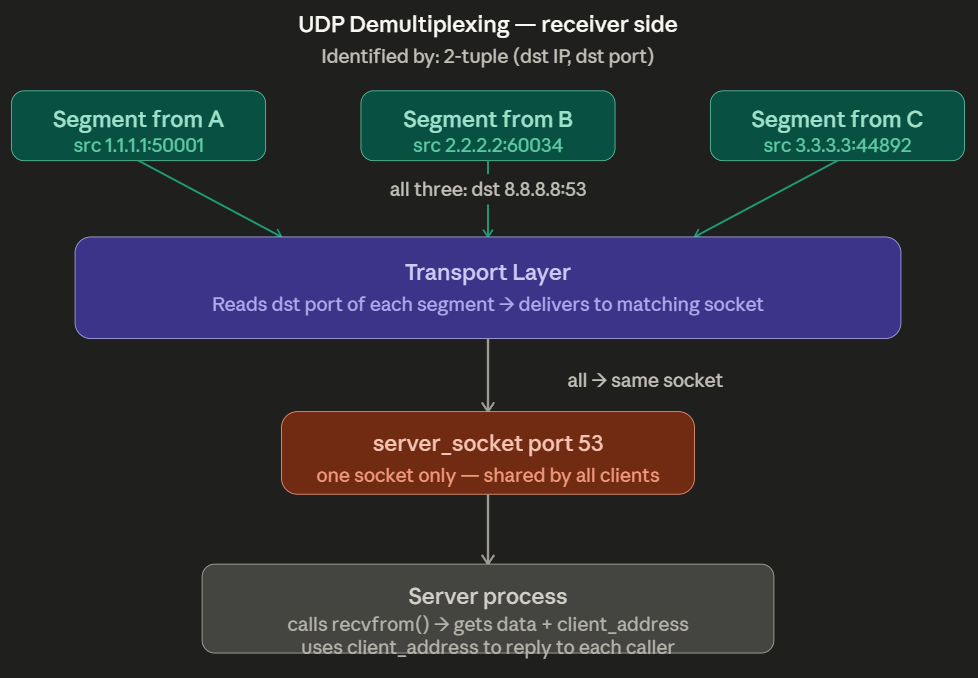
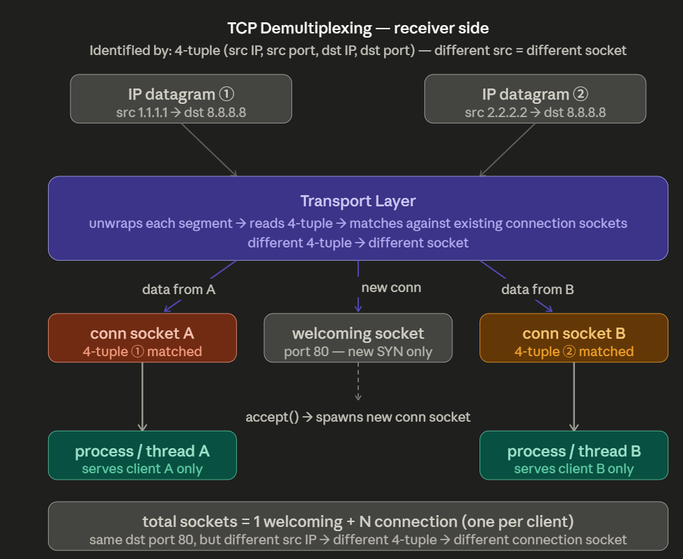
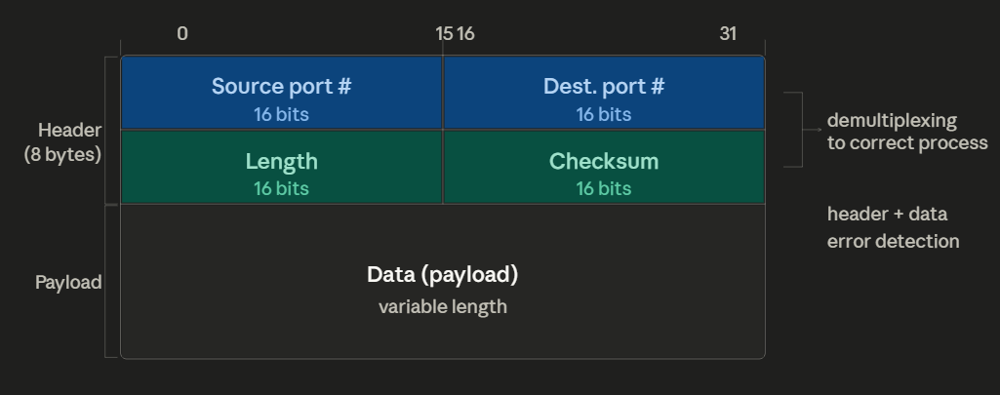
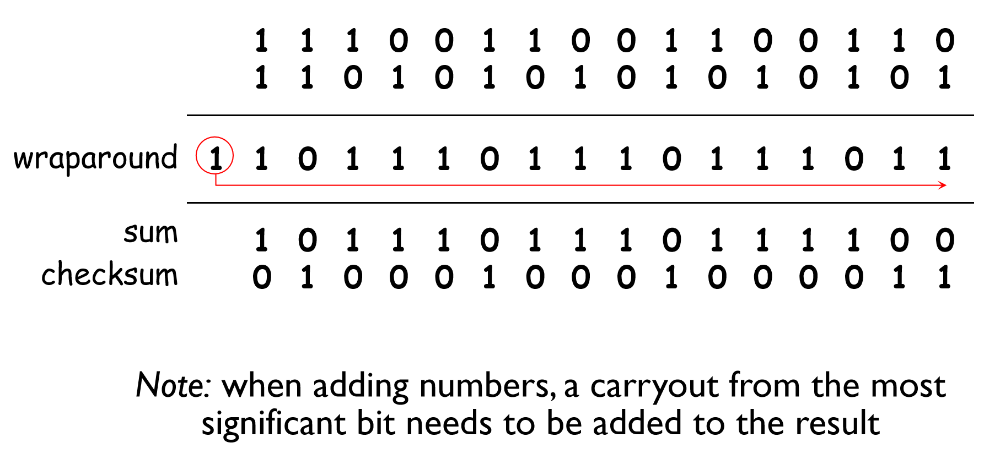
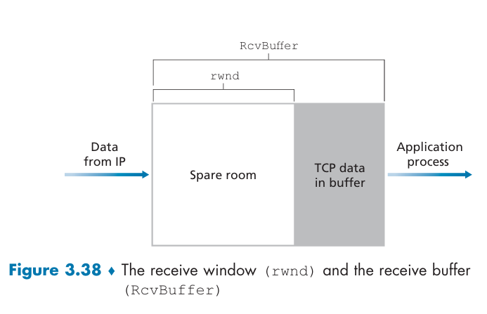
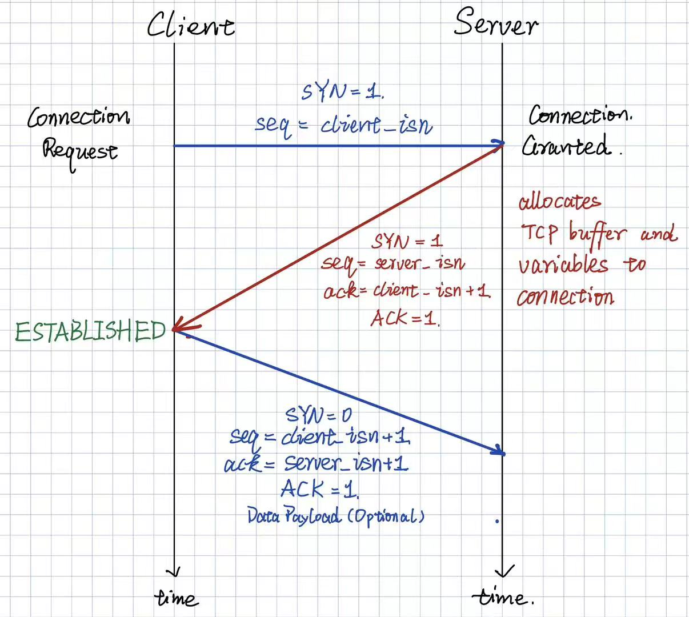
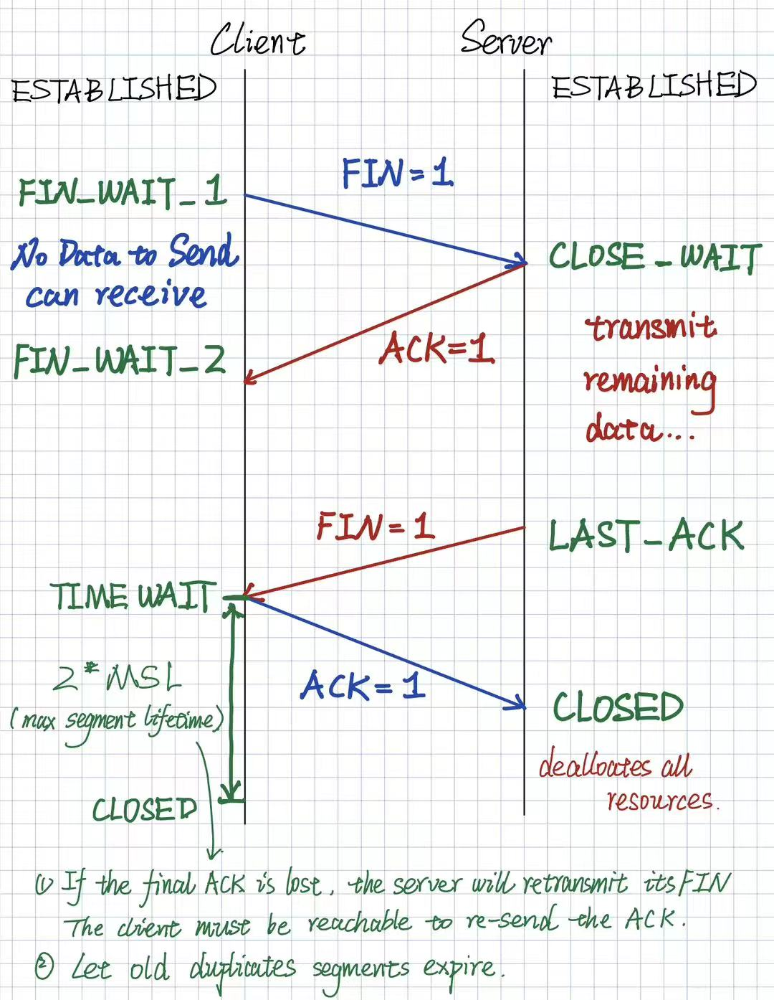
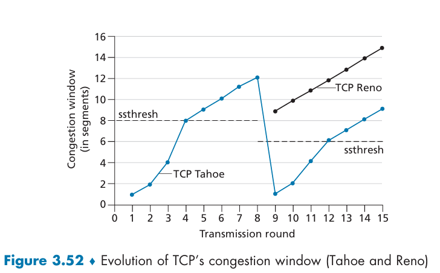
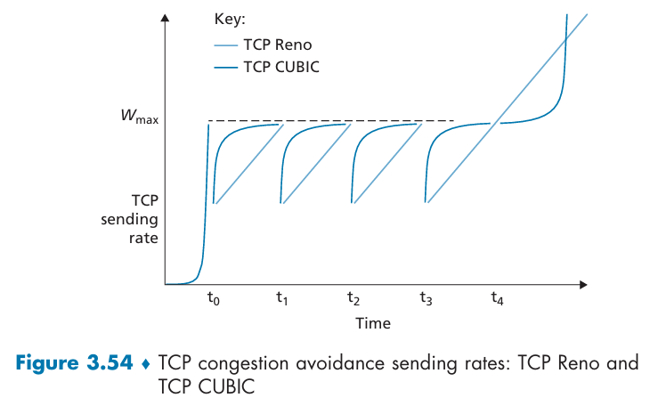

# Chapter 3 Transport Layer

## 3.1 Introduction and Transport-Layer Services

The transport layer provides **logical communication** between **processes** running on different hosts, whereas the network layer provides logical communication between **hosts**.

### Transport-layer Protocols: TCP vs UDP

**TCP (Transmission Control Protocol)**

- Reliable, in-order delivery
- Congestion control
- Flow control
- Connection-oriented

**UDP (User Datagram Protocol)**

- Unreliable, unordered delivery
- A minimal, best-effort service

On the sender side, the transport layer breaks application messages into **segments** and passes them to the network layer as **datagrams**. On the receiver side, it reassembles segments into messages and passes them to the application layer.

---

## 3.2 Multiplexing and Demultiplexing

### Multiplexing (Sender):

1. Each process passes its message through its own socket.
2. The transport layer wraps each message into a **segment**, attaching the **source port** and **destination port** in the header.
3. Each segment is passed to the network layer, which encapsulates it into an **IP datagram** and sends it to the destination.



### UDP Demultiplexing (Receiver):

The destination socket is identified by the **2-tuple (dst IP, dst port)**.

1. The transport layer receives a segment from the network layer.
2. It inspects the destination port field.
3. It locates the matching server socket and places the data into its receive queue.
4. The process calls `recvfrom()` to retrieve the data and obtain the sender's address for replying.

Segments with different source IP/port pairs but the same destination IP/port are delivered to the same socket.



### TCP Demultiplexing (Receiver):

The destination socket is identified by the **4-tuple (src IP, src port, dst IP, dst port)**.

1. The transport layer receives a segment from the network layer.
2. It inspects the 4-tuple `(src IP, src port, dst IP, dst port)`.
3. It tries to match the segment against all existing connection sockets.
   - If it is a new request and no match is found:
     - deliver it to the listening socket
     - complete the three-way handshake
     - `accept()` creates a new connection socket and records the 4-tuple
   - If it belongs to an existing connection:
     - deliver it to the matching connection socket
4. The process calls `recv()` to retrieve the data.



---

# User Datagram Protocol (UDP)

## 3.3 Connectionless Transport: UDP

**UDP (User Datagram Protocol)**  
Reference: [RFC 768 - User Datagram Protocol](https://www.rfc-editor.org/rfc/rfc768)

1. **Connectionless**: No handshake is required before sending.
2. **Unreliable**: No guaranteed delivery, ordering, or retransmission.
3. **Best effort**: UDP provides **no congestion control** and **no flow control**, but it is still widely used for applications that can tolerate loss and do not require ordering, such as streaming media, online gaming, and DNS.

### UDP Segment Format



### Checksum:

1. Sum all 16-bit words and wrap any overflow back to the least significant bit.
2. Take the one's complement (flip all bits).

Example:



--- 

# Transport-Layer Protocols (TCP)

## Reliable Data Transfer (3.4 & 3.5.4)

Core mechanisms for reliable data transfer implemented by TCP:

1. **Error Detection (Checksum)**: The TCP checksum is computed over 16-bit words with overflow wrapped around, and then converted using one's complement. The calculation includes:
   - `Pseudo header` (source IP, destination IP, protocol type, and TCP segment length), which participates in the calculation but is not transmitted
   - `TCP segment header`
   - `TCP segment payload`

   The checksum can detect bit corruption but cannot correct it. The receiver sums the three fields above together with the received checksum. If the result is not all 1s, the segment is considered corrupted and is discarded.

2. **Sequence Numbers and Acknowledgements**: TCP treats data as a continuous **byte stream**.
   - Sequence number: the position of the **first byte of the payload**, starting from the ISN (Initial Sequence Number)
   - Acknowledgement number (cumulative): ACK `N` means the receiver has received all bytes up to `N - 1` and is expecting bytes starting from `N`
   - Both sides can send data and acknowledgements in the same segment, enabling full-duplex communication and piggybacking

   This mechanism solves three problems:
   - detecting duplicates
   - handling out-of-order arrival by buffering and waiting for missing segments
   - handling lost segments through fast retransmission or retransmission after a timeout

3. **Fast Retransmit**: If the sender receives three duplicate ACKs, it assumes the segment is lost and retransmits it immediately, without waiting for the timeout.
4. **Timer and Retransmission**: The sender keeps a timer for the oldest unacknowledged segment. If the timer expires, it retransmits the segment and restarts the timer.
5. **Pipelining**: Multiple unacknowledged segments can be in flight at the same time, improving bandwidth utilization and throughput. The amount of outstanding data is limited by `flow control` and `congestion control`.

## TCP Segment Format (3.5.2)

## RTT Estimation and Timeout (3.5.3)
**Sample RTT**: measured from segment transmission to ACK receipt.
**Estimated RTT**: smoothed RTT estimate using exponential weighted moving average (EWMA).
$$ \text{Estimated RTT} = (1 - \alpha) \times \text{Estimated RTT} + \alpha \times \text{Sample RTT},  \alpha = 0.125 $$
**DevRTT**: estimate of how much $\text{Sample RTT}$ varies from $\text{Estimated RTT}$.
$$\text{DevRTT}= (1 - \beta) \times \text{DevRTT} + \beta \times |\text{Sample RTT} - \text{Estimated RTT}|, \beta = 0.25 $$
**Timeout Interval**:
$$ \text{Timeout Interval} = \text {Estimated RTT} + 4\text{DevRtt} $$
 - Initial timeout is 1 sec; after a timeout. TCP **doubles** the timeout interval temporarily.
 - $\text{Timeout Interval}$ will compute again as $\text{Estimated RTT}$ updates.
## TCP Flow Control (3.5.5)


$$ \text{LastByteReceived} - \text{LastByteRead} = \text{DataInBuffer} \leq \text{ReceiveBuffer} $$

$$ \text{rwnd = \text{ReceiveBuffer} - \text{DataInBuffer}}$$

The receiver advertises its available buffer space through the TCP `receive window` field, and the sender limits how much unacknowledged data it keeps in flight accordingly.

## Connection-oriented Transport: TCP  (3.5.6)

### Establish TCP connection: Three-way Handshake:



### Close TCP Connection:


## TCP Congestion Control (3.6 & 3.7)

Classification based on whether the network-layer provides **explicit feedback**:
### End-to-End Congestion Control (TCP Implementation):
The network-layer does not provide explicit feedback, the hosts themselves must detect congestion or probe bandwidth through:
 - Timeout -> severe congestion
 - Triple duplicate ACKs -> mild congestion -> fast retransmit
 - ACK arrival -> no congestion -> increase cwnd

The TCP sender maintains a **Congestion Window (cwnd)** to limit the amount of unacknowledged data in flight:
$$ \text{TCP Rate} = \frac{\text{Congestion Window(cwnd)} }{\text{RTT}} bytes/sec$$

$$ \text{LastSentByte} - \text{LastByteAcked} \leq \min(\text{cwnd}, \text{rwnd}) $$

Core Mechanism: **Additive Increase/ Multiplicative Decrease (AIMD)**
- Linear (additive) increase in `cwnd` of `1 MSS/RTT` when no congestion.
- Halve (multiplicate) decrease of `cwnd` on congestion detection (timeout or triple duplicate ACKs)
#### 1. Loss-based Congestion Control:
Maximum Segment Size (MSS): the largest segment size that can be sent in a single TCP segment, typically around **1460** bytes

Three Phases of TCP Congestion Control:
1. **Slow Start**: 
   - $ \text{cwnd} += 1 \text{ MSS/ACK} $ (double `cwnd` every RTT), **exponential growth**
   - When $ \text{cwnd} \geq \text{ssthresh (slow start threshold)} $, transition to:
2. **Congestion Avoidance**:
   - $\text{cwnd} += 1 \text{ MSS/RTT}$, linear growth for `TCP Tahoe` and `TCP Reno`, cubic growth for `TCP Cubic`
3. **Fast Recovery**: 
    - $cwnd = ssthresh + 1 \text{MSS}/\text{dupACK}$ when triple duplicate ACKs are received, and then transition to congestion avoidance phase.  
 
Events:
- **Timeout**: $ \text{ssthresh} = \frac{\text{cwnd}}{2}, \text{cwnd} = 1 \text{ MSS} $
- **Triple duplicate ACKs**: $ \text{ssthresh} = \frac{\text{cwnd}}{2}, \text{cwnd} = \text{ssthresh} + 3 \text{ MSS} $

 


#### 2. Delay-based Congestion Control:

Instead of waiting for packet loss, delay-based approaches detect congestion early by monitoring **RTT increase** as an indicator of growing queue lengths.

**Key Idea:** Measure $RTT_{min}$ — the minimum observed RTT, which approximates the uncongested propagation delay. The estimated uncongested throughput is:
$$\text{Uncongested Throughput} = \frac{\text{cwnd}}{RTT_{min}}$$

- If $ \text{actual throughput} \approx \dfrac{\text{cwnd}}{RTT_{min}} $ → path is **uncongested** → increase `cwnd`
- If $ \text{actual throughput} \ll \dfrac{\text{cwnd}}{RTT_{min}} $ → **congestion building** → decrease `cwnd`

**TCP Vegas:**
- Proactively reduces `cwnd` when delay rises, before any packet is dropped.
- Operates under the philosophy: *"Keep the pipe just full, but no fuller."*

---

### Network-Assisted Congestion Control:

The network layer provides **explicit feedback** to help end systems detect and respond to congestion more precisely and proactively.

#### Explicit Congestion Notification (ECN) — RFC 3168

ECN uses **2 bits** in the IP datagram header (Type of Service field), giving 4 possible values:

| ECN bits | Meaning |
|----------|---------|
| `00` / `01` / `10` | ECN-capable transport (sender & receiver support ECN) |
| `11` | **Congestion experienced** — set by a congested router |

**How ECN works (end-to-end signaling loop):**

```
Sender ──────────────────────────────────────► Receiver
         IP datagram with ECN = 11
         (marked by congested router)
                                    ◄──────────
                          TCP ACK with ECE = 1
                          (receiver echoes congestion signal)
Sender receives ECE:
  • Halves cwnd  (same response as triple duplicate ACK)
  • Sets CWR = 1 in next segment  (acknowledges the signal)
```

**Key properties:**
- Congestion is signaled **before** packets are dropped — earlier and less disruptive than loss-based detection.
- Requires support from both endpoints **and** intermediate routers.
